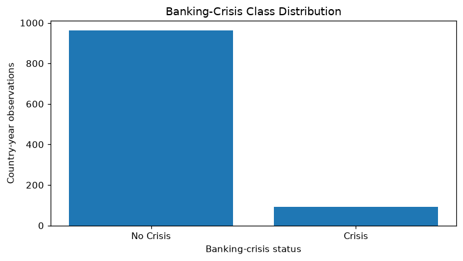
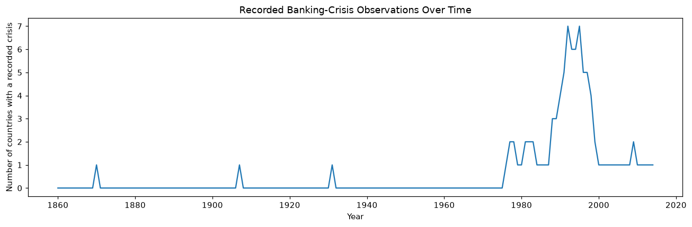
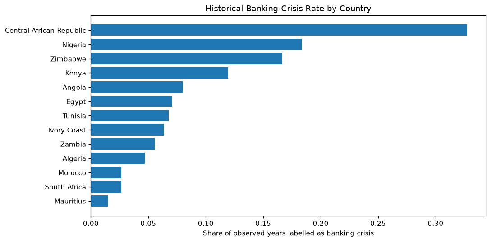
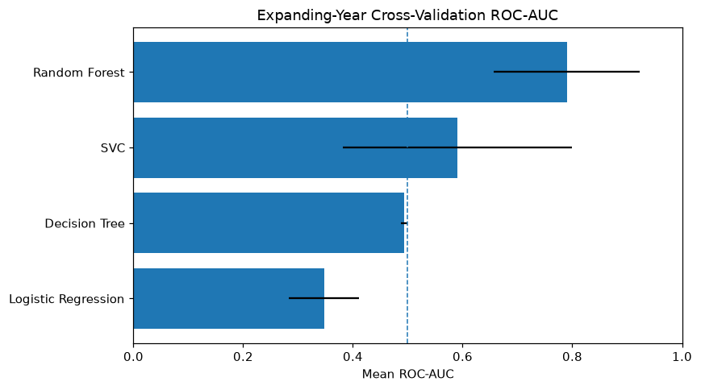
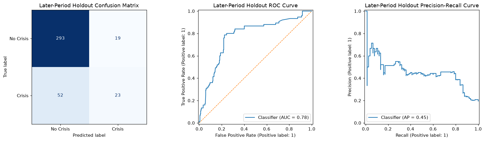

# Banking Crisis Early Warning and Macro-Financial Risk Monitoring

## Project Overview

This project develops a historical one-year-ahead banking-crisis early-warning workflow using macro-financial data for 13 African countries. The analysis combines exploratory data analysis, time-aware model validation, interpretable classification, and an interactive Streamlit application.

This project was originally completed as part of the GoMyCode Data Science Programme.

The central analytical question is:

> Can macro-financial conditions observed in year *t* provide a useful warning signal for whether a banking crisis is recorded in year *t + 1*?

The project is designed as a portfolio demonstration of applied risk modelling. It is not a current country forecast, regulatory stress test, investment recommendation, or policy decision system.

## Live Demo

**Try the deployed application:**

[Launch Streamlit App](STREAMLIT_URL)

The application allows users to enter a historical-style macro-financial scenario and obtain a one-year-ahead model warning score.

## Dataset

The source dataset is the African Economic, Banking and Systemic Crisis dataset. The commonly circulated version contains 1,059 country-year observations across 13 African countries and covers observations from 1860 to 2014.

The original target is `banking_crisis`, recorded as:

- `crisis`: a banking crisis was recorded in that country-year;
- `no_crisis`: no banking crisis was recorded in that country-year.

The raw dataset is highly imbalanced, with banking-crisis years representing a small minority of observations.

### Key variables

| Variable | Description |
| --- | --- |
| `country` | Country name |
| `year` | Observation year |
| `systemic_crisis` | Systemic-crisis indicator |
| `exch_usd` | Exchange rate against the US dollar |
| `domestic_debt_in_default` | Domestic sovereign-debt default indicator |
| `sovereign_external_debt_default` | External sovereign-debt default indicator |
| `gdp_weighted_default` | Debt in default relative to GDP |
| `inflation_annual_cpi` | Annual CPI inflation rate |
| `independence` | Independence indicator in the source data |
| `currency_crises` | Currency-crisis indicator |
| `inflation_crises` | Inflation-crisis indicator |
| `banking_crisis` | Banking-crisis label |

### Data sources

- Kaggle dataset page: https://www.kaggle.com/datasets/chirin/africa-economic-banking-and-systemic-crisis-data
- Harvard Business School Global Crises Data: https://www.hbs.edu/behavioral-finance-and-financial-stability/data/Pages/global.aspx

The repository does not need to redistribute the source CSV. See `data/README.md` for local setup and source information.

## Analytical Framing

For an early-warning interpretation, the modelling target is shifted forward by one year so that country-year features observed in year *t* are used to estimate banking-crisis status in year *t + 1*:

```text
features from year t
        ↓
predict banking-crisis status in year t + 1
```

Only observations with a consecutive next-year record for the same country are used for the one-year-ahead modelling frame.

The source documentation defines `currency_crises` as binary. The four observations coded as `2` are excluded from the modelling frame rather than being assigned an unsupported interpretation.

## Methodology

The workflow includes:

1. data loading and schema validation;
2. duplicate and source-code checks;
3. exploratory analysis of crisis frequency and macro-financial variables;
4. construction of the one-year-ahead target;
5. row-wise transformations for highly skewed exchange-rate and inflation variables;
6. country encoding with `OneHotEncoder(handle_unknown='ignore')`;
7. training-fitted imputation and scaling inside a Scikit-learn preprocessing pipeline;
8. expanding-year cross-validation for model comparison;
9. a later-period temporal holdout for final historical evaluation;
10. refitting the selected specification on all labelled observations for the interactive demo.

## Models Compared

The notebook compares:

- Dummy prior baseline;
- Logistic Regression;
- Decision Tree;
- Random Forest;
- Support Vector Classifier.

Because banking crises are relatively rare, model assessment does not rely on accuracy alone. The main evaluation includes:

- ROC-AUC;
- PR-AUC;
- balanced accuracy;
- precision;
- recall;
- F1-score;
- confusion matrix.

Model selection uses historical expanding-year validation. Logistic Regression is preferred when its ROC-AUC is within a small margin of the strongest candidate because transparency is valuable in an early-warning context. If another candidate produces a clearly stronger validation result, that model can be retained instead.

## Selected Visualisations

The repository includes selected outputs from the exploratory analysis and modelling workflow so that key parts of the project can be reviewed directly from the README.

### Banking Crisis Distribution

The target distribution shows the class imbalance that motivates the use of metrics such as PR-AUC, balanced accuracy, precision, recall, and F1 alongside ROC-AUC.

<p align="center">
  
</p>

### Banking Crises Over Time

This visual provides historical context by showing how recorded banking-crisis observations are distributed across the study period.

<p align="center">
  
</p>

### Banking Crisis Rate by Country

This comparison highlights variation in recorded banking-crisis incidence across the countries represented in the dataset.

<p align="center">
  
</p>

### Model Comparison

Candidate models are compared using time-aware validation and class-imbalance-aware evaluation rather than relying on accuracy alone.

<p align="center">
  
</p>

### Historical Holdout Evaluation

The final historical holdout evaluation summarises how the selected specification performs on a later period that was not used for model selection.

<p align="center">
  
</p>

## Practical Interpretation

The purpose of the model is to demonstrate how historical macro-financial indicators can be organised into an early-warning workflow.

A model score could potentially support further investigation by analysts when used alongside richer macroeconomic, banking-sector, market, supervisory, and institutional information. It should not be interpreted as proof that a banking crisis will or will not occur.

The Streamlit application therefore describes its output as a **historical-pattern warning score**, not as a definitive current forecast.

## Important Limitations

This project has several important limitations:

- the dataset covers a long historical period in which financial systems and institutions changed substantially;
- there are only 13 countries in the source data;
- banking-crisis observations are relatively rare;
- the target is next-year crisis status rather than first-onset only, so part of the signal may reflect persistence across multi-year crisis episodes;
- the available predictors are limited compared with a modern macroprudential monitoring system;
- annual data cannot capture fast-moving financial stress;
- country identity can capture structural differences but limits generalisation to unseen countries;
- the model has no live market, supervisory, balance-sheet, credit-growth, liquidity, asset-quality, or funding data;
- historical associations should not be interpreted as causal effects;
- a portfolio model is not a substitute for expert macro-financial surveillance.

## Recommended Real-World Next Steps

A stronger operational study could incorporate:

- credit growth and credit-to-GDP gaps;
- banking-sector capital and liquidity ratios;
- non-performing loan measures;
- property and asset-price indicators;
- interest rates and yield spreads;
- current-account and reserve measures;
- market volatility and funding indicators;
- higher-frequency data;
- country-specific institutional variables;
- probability calibration;
- threshold selection based on policy costs;
- external and rolling temporal validation;
- model monitoring and drift assessment;
- human analyst review and governance controls.

## Streamlit Application

The Streamlit app:

- loads the historical dataset;
- constructs the same one-year-ahead modelling frame used by the analysis;
- applies the same preprocessing and model-selection logic;
- accepts human-readable macro-financial scenario inputs;
- generates a historical model warning score;
- displays later-period holdout metrics;
- communicates the limitations of the output.

The app does not require the notebook to run before it starts.

## Repository Structure

```text
banking-crisis-early-warning/
│
├── app.py
├── README.md
├── requirements.txt
├── .gitignore
├── LICENSE
│
├── notebooks/
│   └── banking_crisis_early_warning.ipynb
│
├── src/
│   ├── __init__.py
│   └── modeling.py
│
├── images/
│   ├── banking_crisis_distribution.png
│   ├── banking_crises_over_time.png
│   ├── banking_crisis_rate_by_country.png
│   ├── model_comparison.png
│   ├── holdout_evaluation.png
│   └── model_interpretation.png
│
└── data/
    └── README.md
```

The notebook is the analytical narrative. `src/modeling.py` contains reusable preprocessing, validation, modelling, and inference logic shared with the Streamlit application.

## Run Locally

### 1. Clone the repository

```bash
git clone https://github.com/victoruzoe/Banking-Crisis-Early-Warning-System.git
cd banking-crisis-early-warning
```

### 2. Create or activate an environment

For example, with Conda:

```bash
conda activate datastudio
```

### 3. Install dependencies

A single `requirements.txt` contains the dependencies needed for both the notebook workflow and the Streamlit application.

```bash
py -m pip install -r requirements.txt
```

### 4. Run the Streamlit app

```bash
py -m streamlit run app.py
```

### 5. Run the notebook

Open:

```text
notebooks/banking_crisis_early_warning.ipynb
```

The project first checks for a local CSV under `data/`. If none is present, it attempts to load a public mirror of the source dataset.

## Technologies

- Python
- Pandas
- NumPy
- Scikit-learn
- Matplotlib
- Jupyter Notebook
- Streamlit

## Conclusion

This project frames banking-crisis modelling as a time-aware early-warning problem rather than a same-year classification exercise. It demonstrates how historical macro-financial observations can be transformed into a one-year-ahead modelling workflow, validated with expanding time windows, and translated into an interactive monitoring demonstration.

Its professional value is not based on claiming that a small historical dataset can reliably forecast modern banking crises. The project instead demonstrates disciplined target design, leakage-aware validation, class-imbalance-aware evaluation, transparent limitations, and the translation of an analytical workflow into a usable application.
